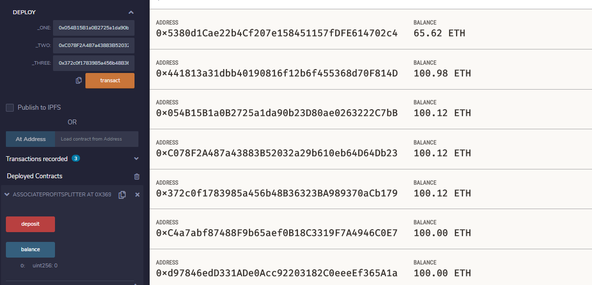
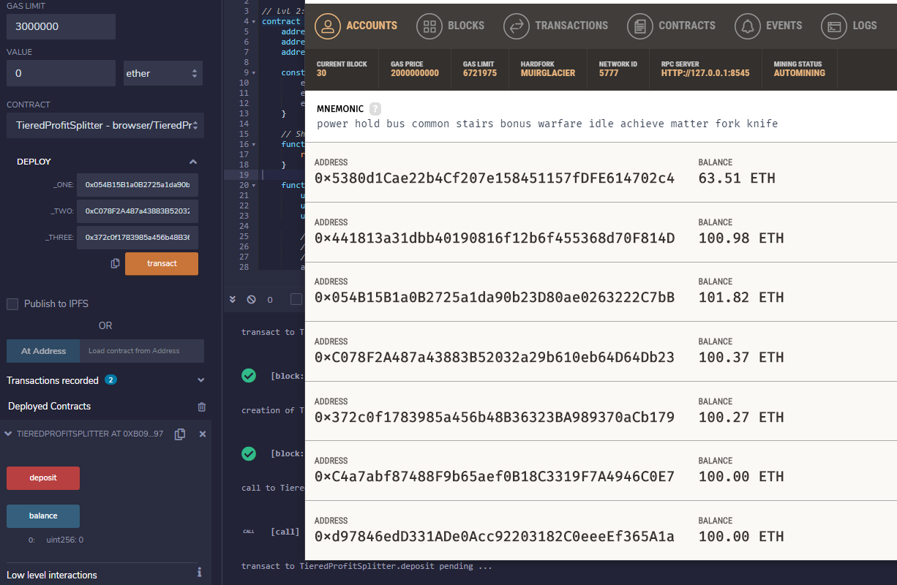
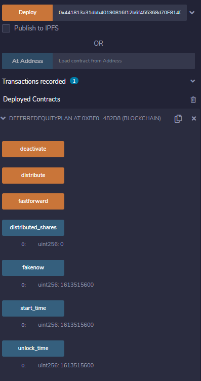
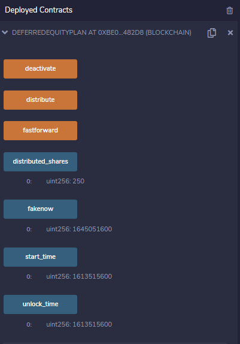
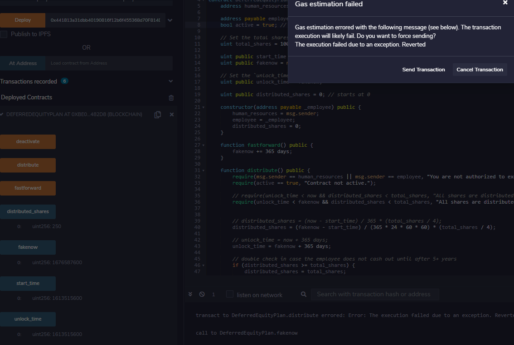

# Solidity
## Level 1 - Associate Profit Splitter

- Any wei transfer to the contract will be split equally amongs 3 employees specified at contract creation. The contract will send the remainder back to sender.

## Level 2 - Tiered Profit Splitter

- Any wei will be split 65/25/15 for address 1, address 2, and address 3 respectively. The contract will send any remainder to address 1.

## Level 3 - Deferred Equity Plan

- The contract assume 1000 units of shares (this should have been part of the constructor, but I'll stick with the bad design of this homework) to be allocate to address employee at 25% of total share per year. This contract will lock for 365 days after execution. After 365 days, the contract will allow another vesting. This contract will become inactive by manual deactivation or fully vested.

As Deployed

First Distribution

Distribution Before 365 days

